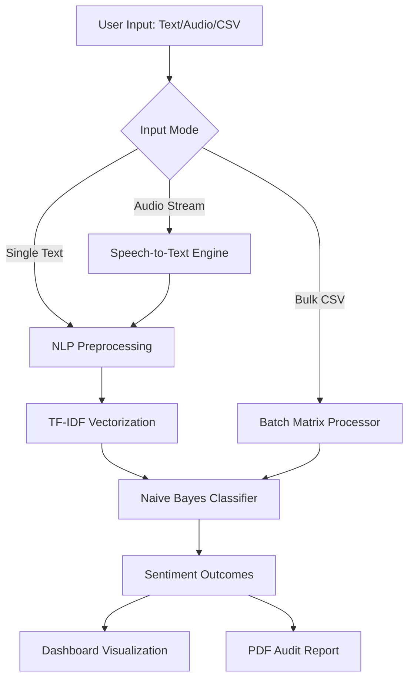

<div align="center">


# 🤖 Sentira Platinum
### **Ultra-Premium SaaS Sentiment Intelligence System**

[](https://www.python.org/)
[](https://sentiment-projec.streamlit.app/)
[](https://scikit-learn.org/)
[](https://www.nltk.org/)

**Analyze product reviews and detect sentiment instantly using state-of-the-art AI.**

[🚀 Live Demo](https://sentiment-projec.streamlit.app/) • [📂 Bulk Audit](#-bulk-dataset-audit) • [🎙️ Voice Analytics](#%EF%B8%8F-voice-intelligence) • [📊 System Architecture](#-system-architecture)

---

</div>

## 🌟 Executive Overview

Sentira Platinum is an end-to-end **Sentiment Analysis System** designed to transform raw customer feedback into actionable insights. By combining traditional NLP techniques with machine learning, it provides a seamless interface for analyzing individual reviews, bulk datasets, and voice-dictated feedback.

### 🚀 Key Capabilities

*   **🎯 Real-time Sentiment Intelligence**: Instant classification into **Positive**, **Neutral**, or **Negative** categories with high confidence scores.
*   **🎙️ Multi-modal Support**: Integrated Voice-to-Sentiment engine with intelligent segmentation.
*   **📂 Bulk Data Audit**: High-performance processing of large CSV datasets using matrix transformations.
*   **📄 Automated Reporting**: One-click generation of professional PDF audit reports with visual analytics.
*   **💎 Premium UX**: A minimalist, high-conversion SaaS dashboard powered by Streamlit.

---

## 🛠️ Tech Stack

| Component | Technology | Role |
| :--- | :--- | :--- |
| **Frontend/UI** | **Streamlit** | Professional SaaS Dashboard & Hosting |
| **ML Engine** | **Scikit-Learn** | Multinomial Naive Bayes Classifier |
| **NLP Core** | **NLTK** | Tokenization, Lemmatization, & Stopword Filtering |
| **Feature Extraction** | **TF-IDF** | Vectorization of Textual Data |
| **Audio Engine** | **SpeechRecognition** | Google Cloud Speech API Integration |
| **Reporting** | **ReportLab** | Dynamic PDF Generation Engine |

---

## 🏗️ System Architecture



---

## 📂 Project Structure

```bash
Sentiment analysis/
├── data/
│   ├── raw/                 # Original Flipkart review datasets
│   └── processed/           # Cleaned and engineered feature sets
├── models/
│   ├── sentiment_classifier_nb.pkl # Trained Naive Bayes Binary
│   └── tfidf_vectorizer.pkl        # Serialized TF-IDF Vocabulary
├── src/
│   ├── app.py               # Main Sentira Platinum Hub
│   ├── step1_to_step5.py    # Complete Data Science Pipeline
│   └── step6_visualization.py # Analytics Engine
├── docs/                    # Technical Manuals & Assets
└── requirements.txt         # Intelligence Dependencies
```

---

## 🚀 Getting Started

### 1️⃣ Installation
Ensure you have **Python 3.12+** installed.
```bash
git clone https://github.com/Karthik0484/Sentiment-analysis-on-pdt-review.git
cd Sentiment-analysis-on-pdt-review
pip install -r requirements.txt
```

### 2️⃣ Launching the Intelligence Hub
```bash
cd src
streamlit run app.py
```

---

## 🏎️ Performance Optimizations

*   **⚡ Resource Caching**: Uses `@st.cache_resource` for O(1) model retrieval from RAM.
*   **📊 Matrix Transformations**: Eliminated loop-based processing for bulk audits, utilizing NumPy/Pandas vectorization.
*   **🔄 Chunked Transcription**: Audio files are split into parallel 15s segments to ensure API reliability.
*   **🥗 Negation Preservation**: Custom logic prevents loss of meaning during text cleaning (e.g., keeping "not").

---

## 🗺️ Roadmap

- [ ] **BERT Integration**: Migrating to Transformer models for deeper contextual accuracy.
- [ ] **Real-time Streaming**: Micro-latency voice processing via WebSockets.
- [ ] **Multi-lingual Support**: Expanding beyond English to regional languages.

---

<div align="center">

</div>

